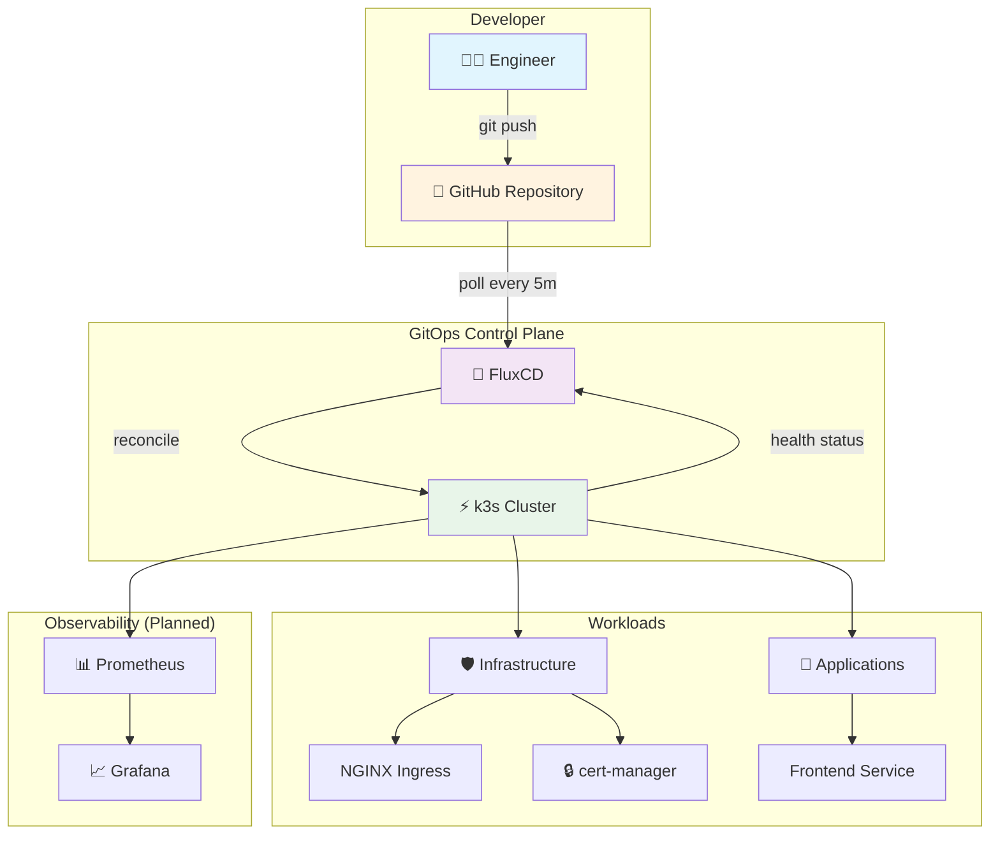
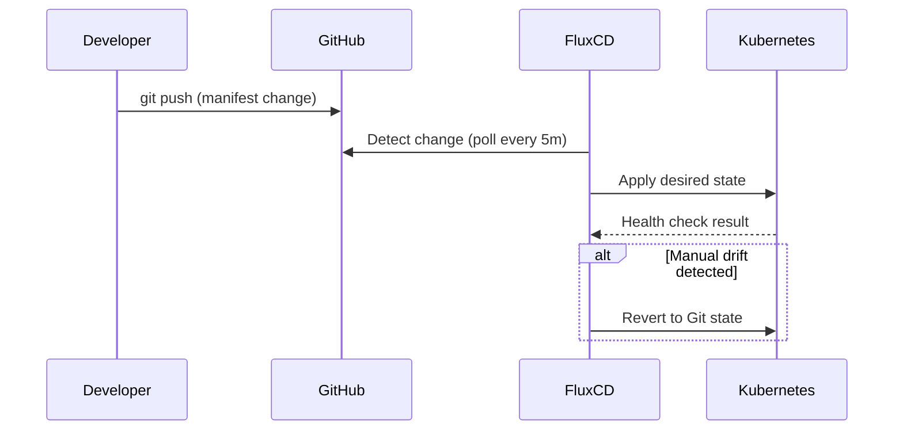

# 🏗️ SRE Platform Lab

A production-grade Kubernetes platform demonstrating **GitOps workflows**, **SRE practices**, and **platform engineering** principles. Built to showcase senior-level DevOps/SRE operational maturity.

> **Philosophy:** Every component in this lab follows production best practices. No shortcuts without explanation. No TODO without a plan. Every decision is documented with its production relevance.

---

## 📐 Architecture



📖 **Detailed architecture:** [docs/architecture.md](docs/architecture.md)

---

## 🚀 Quick Start

### Prerequisites

- Linux (Ubuntu 20.04+ / WSL2)
- [kubectl](https://kubernetes.io/docs/tasks/tools/) >= 1.28
- [flux CLI](https://fluxcd.io/flux/installation/) >= 2.0
- [Terraform](https://developer.hashicorp.com/terraform/downloads) >= 1.0
- GitHub account + Personal Access Token

### 1. Bootstrap the Cluster

```bash
# Install k3s (CNCF-certified Kubernetes)
curl -sfL https://get.k3s.io | \
  INSTALL_K3S_VERSION=v1.33.11+k3s1 \
  K3S_TOKEN=sre-platform-lab-token \
  sh -s - --disable=traefik --write-kubeconfig-mode 644

# Configure kubectl
mkdir -p ~/.kube && sudo cp /etc/rancher/k3s/k3s.yaml ~/.kube/config
sudo chown $(id -u):$(id -g) ~/.kube/config
```

### 2. Bootstrap FluxCD

```bash
export GITHUB_TOKEN=your_pat_here
export GITHUB_USER=your_username

flux bootstrap github \
  --owner=$GITHUB_USER \
  --repository=sre-platform-lab \
  --branch=main \
  --path=clusters/dev \
  --personal \
  --read-write-key
```

### 3. Verify

```bash
kubectl get pods -A
flux get kustomizations
kubectl get pods -n frontend
```

📖 **Full walkthrough:** [docs/k3s-bootstrap.md](docs/k3s-bootstrap.md)

---

## 📁 Repository Structure

```
sre-platform-lab/
├── terraform/                          # Infrastructure as Code
│   ├── modules/
│   │   └── k3s-cluster/               # Reusable k3s provisioning module
│   │       ├── main.tf                # k3s install + readiness verification
│   │       ├── variables.tf           # Module inputs with validation
│   │       ├── outputs.tf             # Module outputs (sensitive marked)
│   │       └── versions.tf            # Provider version constraints
│   └── environments/
│       ├── dev/                        # Dev environment composition
│       │   ├── main.tf                # Module call with dev-specific values
│       │   ├── variables.tf           # Environment-level variables
│       │   ├── terraform.tfvars       # Dev variable values
│       │   ├── providers.tf           # Provider configuration
│       │   ├── backend.tf             # State backend (local + prod example)
│       │   └── outputs.tf             # Environment outputs
│       ├── staging/                    # Staging placeholder (future milestone)
│       └── prod/                       # Production placeholder (future milestone)
│
├── clusters/                           # FluxCD cluster definitions
│   └── dev/
│       ├── flux-system/               # Flux bootstrap manifests (auto-generated)
│       │   ├── gotk-components.yaml   # Flux controller definitions
│       │   ├── gotk-sync.yaml         # GitRepository + Kustomization sync
│       │   └── kustomization.yaml     # Flux system resource list
│       ├── infrastructure.yaml        # Flux Kustomization → infrastructure/
│       └── apps.yaml                  # Flux Kustomization → apps/ (dependsOn: infrastructure)
│
├── infrastructure/                     # Platform-level components
│   ├── kustomization.yaml             # Aggregates all infra components
│   ├── nginx-ingress/                 # NGINX ingress controller (HelmRelease)
│   │   ├── namespace.yaml             # Dedicated namespace for ingress
│   │   ├── helm-repository.yaml       # Chart source (official ingress-nginx)
│   │   ├── helm-release.yaml          # Flux-managed Helm deployment
│   │   └── kustomization.yaml
│   └── cert-manager/                  # Certificate management (HelmRelease)
│       ├── namespace.yaml             # Dedicated namespace for cert-manager
│       ├── helm-repository.yaml       # Chart source (official Jetstack)
│       ├── helm-release.yaml          # Flux-managed Helm deployment
│       ├── cluster-issuer.yaml        # Self-signed CA + CA issuer for dev
│       └── kustomization.yaml
│
├── apps/                              # Application manifests
│   └── frontend/                      # Sample nginx application
│       ├── namespace.yaml             # Dedicated namespace (never use default!)
│       ├── deployment.yaml            # Probes, resources, anti-affinity, rolling updates
│       ├── service.yaml               # ClusterIP service (ingress handles external)
│       ├── ingress.yaml               # TLS ingress with cert-manager annotation
│       ├── hpa.yaml                   # Horizontal Pod Autoscaler (CPU 70%)
│       ├── pdb.yaml                   # PodDisruptionBudget (minAvailable: 1)
│       ├── networkpolicy.yaml         # Default-deny + allow-from-ingress + egress
│       ├── kustomization.yaml         # Base resource list
│       └── overlays/                  # Environment-specific overrides
│           ├── dev/                   # 2 replicas, lower limits, self-signed TLS
│           ├── staging/               # 3 replicas, higher limits, PDB minAvailable: 2
│           └── prod/                  # 5 replicas, required anti-affinity, PDB minAvailable: 3
│
├── monitoring/                         # Prometheus + Grafana (Milestone 3)
├── runbooks/                           # Operational runbooks (Milestone 4)
├── postmortems/                        # Blameless postmortems (Milestone 4)
│
├── docs/                              # Documentation
│   ├── k3s-bootstrap.md               # Cluster setup guide
│   └── architecture.md                # Architecture + Mermaid diagrams
│
├── .gitignore                          # Prevents secrets, state, IDE files
└── README.md                           # This file
```

---

## 🛠️ Tech Stack

| Layer | Technology | Purpose |
|-------|-----------|---------|
| **Kubernetes** | k3s v1.33.11 | CNCF-certified K8s, single binary, production features |
| **GitOps** | FluxCD v2 | Declarative cluster reconciliation from Git |
| **IaC** | Terraform >= 1.0 | Infrastructure provisioning with modular composition |
| **Ingress** | NGINX Ingress | HTTP traffic routing, TLS termination, HelmRelease-managed |
| **TLS** | cert-manager | Automatic certificate provisioning and renewal |
| **Monitoring** | Prometheus + Grafana (planned) | Metrics collection and visualization |
| **Secrets** | External Secrets + Vault (planned) | Secure secrets management |

---

## ✅ SRE Features Checklist

Progress of production SRE practices implemented across milestones:

### Milestone 1 — Foundation ✅
- [x] GitOps reconciliation loop (FluxCD)
- [x] Infrastructure as Code (Terraform modules)
- [x] Environment separation (dev/staging/prod structure)
- [x] Resource requests and limits on all pods
- [x] Liveness and readiness probes
- [x] Namespace isolation
- [x] Rolling update strategy
- [x] Kubernetes recommended labels
- [x] Kustomize for manifest composition
- [x] Dependency-ordered reconciliation (flux-system → infra → apps)
- [x] Drift detection (Flux reverts manual changes)
- [x] Security-conscious .gitignore

### Milestone 2 — Platform ✅
- [x] NGINX ingress controller via HelmRelease
- [x] cert-manager for automatic TLS
- [x] Horizontal Pod Autoscaler (HPA)
- [x] PodDisruptionBudgets (PDB)
- [x] Anti-affinity rules for pod distribution
- [x] Network policies (default-deny + allow-specific)
- [x] Kustomize overlays for environment promotion (dev/staging/prod)

### Milestone 3 — Observability
- [ ] Prometheus + Grafana stack
- [ ] Custom dashboards per service
- [ ] Alerting rules with severity levels
- [ ] SLI/SLO definitions and tracking
- [ ] Error budget policies

### Milestone 4 — Operational Excellence
- [ ] Operational runbooks
- [ ] Blameless postmortem templates
- [ ] Incident response simulation
- [ ] Rollback strategy documentation
- [ ] Chaos engineering experiments

### Milestone 5 — Security & Hardening
- [ ] External Secrets Operator + Vault
- [ ] Pod Security Standards enforcement
- [ ] RBAC least-privilege policies
- [ ] Image verification with Cosign
- [ ] Supply chain security

---

## 🧪 How to Verify GitOps Is Working

The single most important test — does Flux revert manual changes?

```bash
# 1. Manually scale the frontend beyond Git-defined state
kubectl scale deployment frontend -n frontend --replicas=5

# 2. Watch Flux detect the drift and revert it (within 5 minutes)
kubectl get deployment frontend -n frontend -w

# 3. The replica count will return to 2 (as defined in Git)
# This is GitOps in action: Git is the source of truth.
```

---

## 📊 Reconciliation Flow



---

## 🔑 Key Production Practices Demonstrated

### 1. Git as Single Source of Truth
No `kubectl apply` in production. Every change is a Git commit with audit trail, peer review, and rollback capability.

### 2. Dependency-Ordered Reconciliation
FluxCD's `dependsOn` ensures infrastructure is healthy before apps deploy. No race conditions.

### 3. Resource Requests and Limits
Every pod defines CPU/memory requests (scheduling guarantee) and limits (noisy neighbor protection). Missing these is a production anti-pattern.

### 4. Health Probes
Liveness probes restart dead processes. Readiness probes control traffic routing. Using both enables zero-downtime rolling updates.

### 5. Namespace Isolation
Dedicated namespaces per application. Enables RBAC, network policies, resource quotas, and blast radius reduction.

### 6. Modular Terraform
Reusable modules with environment compositions. DRY IaC that scales across dev/staging/prod without duplication.

### 7. Environment Separation
Each environment (dev/staging/prod) has its own Terraform state, variable overrides, and promotion path.

### 8. Infrastructure vs. Application Separation
Terraform creates the cluster. FluxCD configures what runs on it. Clean separation of concerns with no overlap.

---

## 🔄 GitOps Workflow

```bash
# Make a change to the application
vim apps/frontend/deployment.yaml

# Commit and push
git add apps/frontend/deployment.yaml
git commit -m "feat(frontend): increase replicas to 3 for load handling"
git push origin main

# Flux detects the change within 5 minutes and applies it
flux get kustomizations --watch

# Verify the change reached the cluster
kubectl get deployment frontend -n frontend
```

**In production, this workflow includes:**
- Pull request reviews before merging
- CI pipeline validation (lint, dry-run, policy check)
- Staging promotion before production
- Automated rollback on health check failure

---

## 📈 Milestone Roadmap

| Milestone | Status | Focus |
|-----------|--------|-------|
| **M1: Foundation** | ✅ Complete | Repo structure, k3s, FluxCD, sample app |
| **M2: Platform** | ✅ Complete | Ingress, cert-manager, HPA, PDB, network policies, overlays |
| **M3: Observability** | 🔜 Next | Prometheus, Grafana, dashboards, alerts |
| **M4: Operations** | 📋 Planned | Runbooks, postmortems, incident simulation |
| **M5: Security** | 📋 Planned | Vault, RBAC, PSS, supply chain security |
| **M6: Advanced** | 📋 Planned | Multi-cluster, chaos engineering, SLO tracking |

---

## 🤝 Contributing

This is a personal portfolio project, but the practices demonstrated here are meant to be educational. Key principles:

1. **Every change through Git** — no manual cluster modifications
2. **Document architectural decisions** — future you will thank present you
3. **Explain tradeoffs** — no solution is perfect; honesty shows maturity
4. **Test before pushing** — `kubectl apply --dry-run=client` is your friend

---

## 📜 License

This project is for educational and portfolio purposes. Use it as a reference for building your own production-grade platforms.

---

## 🙏 Acknowledgments

- [FluxCD](https://fluxcd.io/) — GitOps toolkit for Kubernetes
- [k3s](https://k3s.io/) — Lightweight Kubernetes by SUSE
- [Google SRE Book](https://sre.google/sre-book/table-of-contents/) — SRE principles and practices
- [Kubernetes Documentation](https://kubernetes.io/docs/) — Official K8s reference
