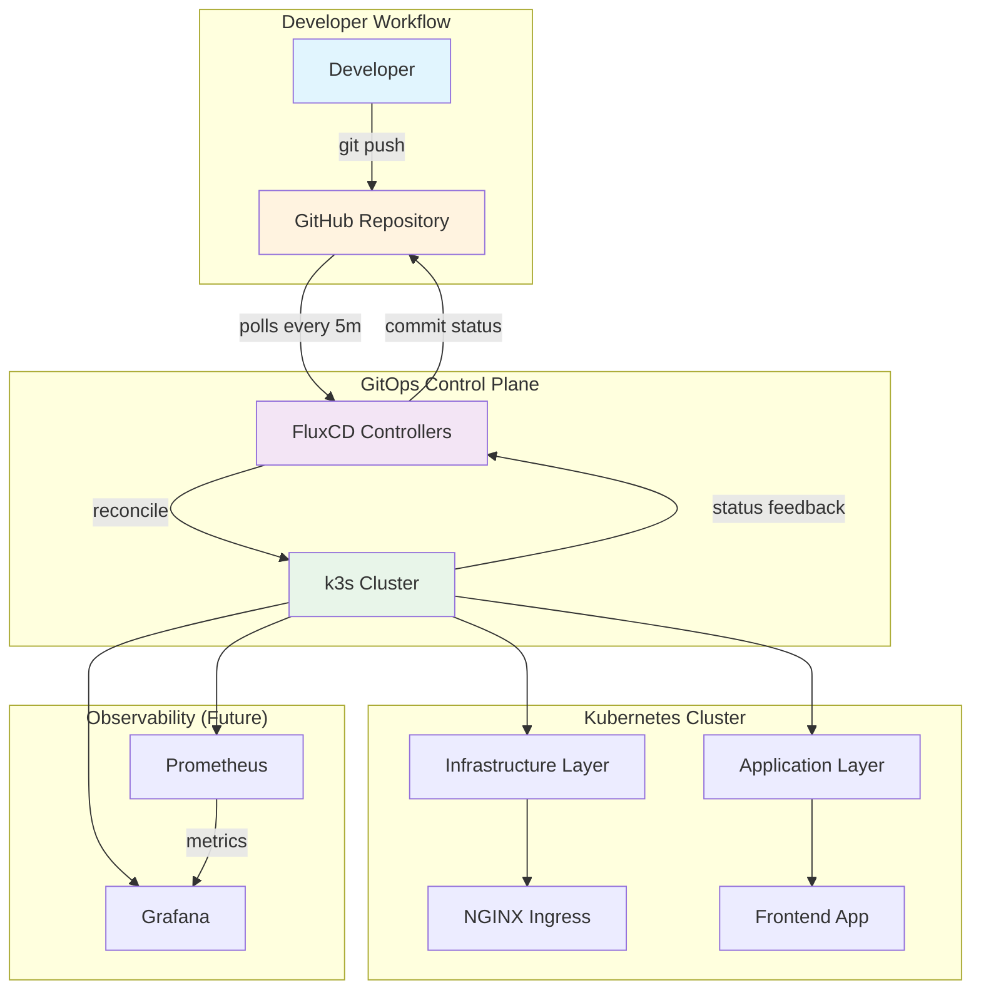
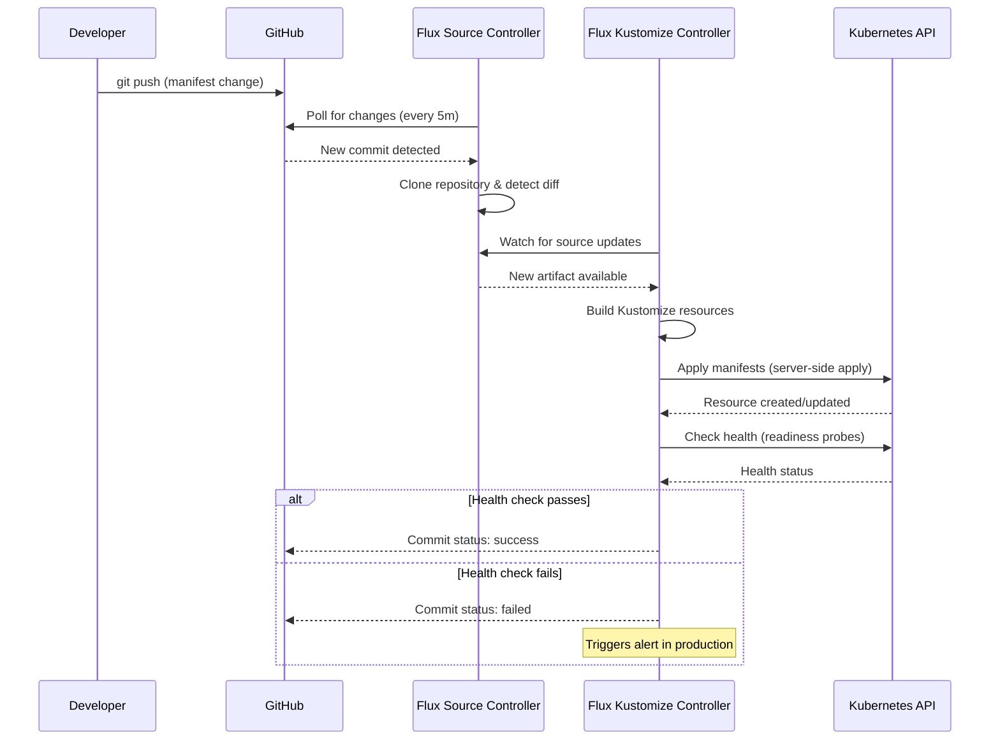
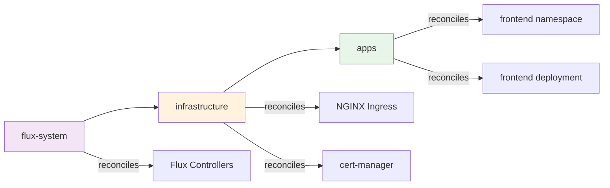
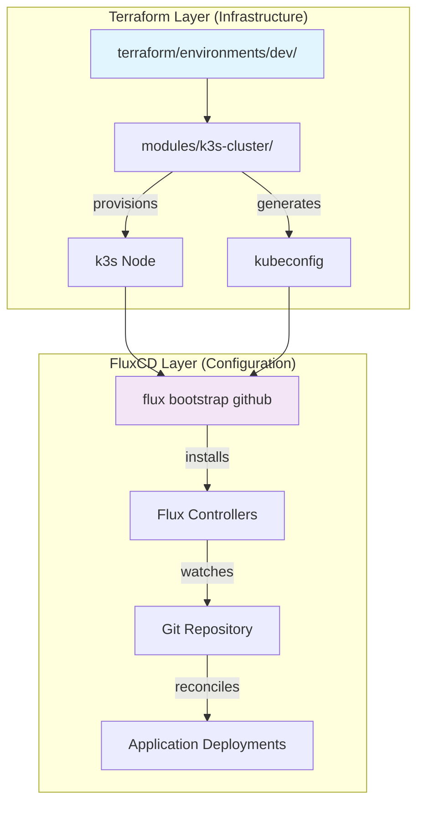

# Architecture

## System Overview

The SRE Platform Lab implements a production-grade GitOps workflow where **Git is the single source of truth** for all cluster state. No manual `kubectl apply` — everything flows through the repository.

---

## High-Level Architecture



---

## GitOps Reconciliation Flow

This diagram shows how FluxCD ensures the cluster state matches the Git repository:



---

## Reconciliation Dependency Graph

FluxCD supports dependency ordering between Kustomizations. This prevents race conditions:



**Why this ordering matters:**
1. `flux-system` must be healthy before anything else works
2. `infrastructure` (ingress, cert-manager) must be running before apps need them
3. `apps` are deployed last, ensuring all dependencies are ready

Without `dependsOn`, apps could be deployed before the ingress controller exists, causing failing Ingress resources and confusing errors.

---

## Repository Structure → Cluster Mapping

This diagram shows how each directory in the repository maps to Kubernetes resources:

```mermaid
graph TB
    subgraph "Repository Structure"
        Root[sre-platform-lab/]
        Root --> ClustersDir[clusters/]
        Root --> InfraDir[infrastructure/]
        Root --> AppsDir[apps/]
        Root ├── MonitorDir[monitoring/]
        Root ├── RunbooksDir[runbooks/]
        Root ├── PostmortemsDir[postmortems/]
        Root └── TerraformDir[terraform/]
        
        ClustersDir --> DevCluster[dev/]
        DevCluster ├── FluxSys[flux-system/]
        DevCluster ├── InfraYaml[infrastructure.yaml]
        DevCluster └── AppsYaml[apps.yaml]
        
        InfraDir ├── NginxIngress[nginx-ingress/]
        InfraDir ├── CertManager[cert-manager/]
        
        AppsDir ├── FrontendApp[frontend/]
        FrontendApp ├── Overlays[overlays/]
    end

    subgraph "Kubernetes Cluster"
        FluxNS[flux-system namespace]
        IngressNS[ingress-nginx namespace]
        CertNS[cert-manager namespace]
        FrontendNS[frontend namespace]
    end

    FluxSys -->|creates| FluxNS
    InfraYaml -->|reconciles| IngressNS
    InfraYaml -->|reconciles| CertNS
    AppsYaml -->|reconciles| FrontendNS
    NginxIngress -->|deploys to| IngressNS
    CertManager -->|deploys to| CertNS
    FrontendApp -->|deploys to| FrontendNS

    style Root fill:#fafafa
    style FluxNS fill:#f3e5f5
    style IngressNS fill:#fff3e0
    style FrontendNS fill:#e8f5e9
```

---

## Infrastructure as Code Layer

Terraform manages the infrastructure layer (cluster provisioning), while FluxCD manages the configuration layer (what runs on the cluster):



**Separation of concerns:**
- **Terraform**: "What infrastructure exists" (cluster, networking, IAM)
- **FluxCD**: "What runs on the infrastructure" (deployments, services, ingress)

This separation is the production standard. Terraform creates the cluster, then hands off to Flux for everything else. In CI/CD, this looks like:

1. `terraform apply` → Cluster exists
2. `flux bootstrap` → Flux installed and watching Git
3. All subsequent changes are Git commits, never `kubectl apply`

---

## Security Architecture (Current + Planned)

```mermaid
graph TB
    subgraph "Current (Milestones 1-2)"
        GitAuth[GitHub PAT for Flux auth]
        K3sToken[k3s cluster token]
        Kubeconfig[kubeconfig file]
        TLS[cert-manager + self-signed CA]
        NP[Network Policies - default deny]
        AntiAffinity[Pod anti-affinity]
        PDB[PodDisruptionBudgets]
        HPA[Horizontal Pod Autoscaler]
    end

    subgraph "Planned (Future Milestones)"
        SSO[OIDC/SSO for kubectl]
        Vault[HashiCorp Vault for secrets]
        ESO[External Secrets Operator]
        Cosign[Cosign image verification]
        RBAC[Strict RBAC policies]
        PSS[Pod Security Standards]
        Calico[Calico/Cilium CNI for NP enforcement]
    end

    GitAuth -.->|upgrade to| Cosign
    K3sToken -.->|upgrade to| Vault
    Kubeconfig -.->|upgrade to| SSO
    TLS -.->|upgrade to| Vault
    NP -.->|enforced by| Calico
    ESO --> Vault
    RBAC --> PSS

    style GitAuth fill:#e8f5e9
    style SSO fill:#fff3e0
    style Vault fill:#fce4ec
```



---

## Technology Stack

| Layer | Technology | Version | Why |
|-------|-----------|---------|-----|
| OS | Ubuntu / WSL2 | 20.04+ | Broad compatibility, production-like |
| Kubernetes | k3s | v1.33.11+k3s1 | CNCF-certified, single binary, low resource |
| GitOps | FluxCD | v2.x | Lightweight, CNCF graduated, Kustomize-native |
| IaC | Terraform | >= 1.0 | Industry standard, modular, state management |
| Ingress | NGINX | v4.12.1 (HelmRelease) | Battle-tested, rich annotations, wide adoption |
| TLS | cert-manager | v1.17.2 (HelmRelease) | Auto certificate provisioning, Let's Encrypt / CA |
| Monitoring | Prometheus + Grafana | (Milestone 3) | CNCF ecosystem standard |
| Container Runtime | containerd | (bundled with k3s) | Production default (not Docker) |
